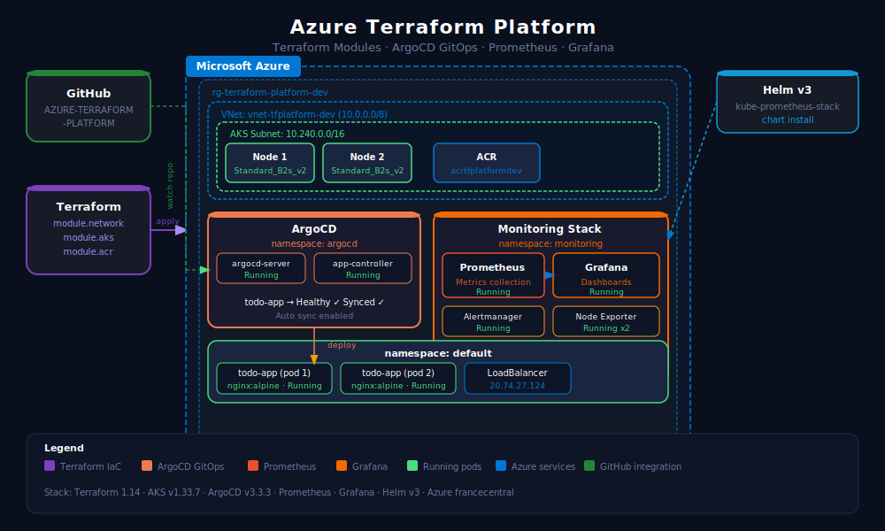
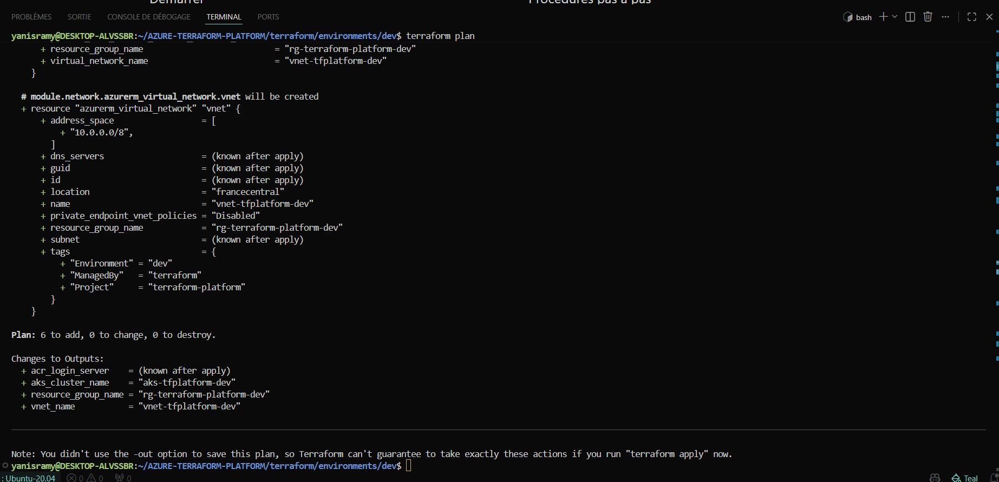
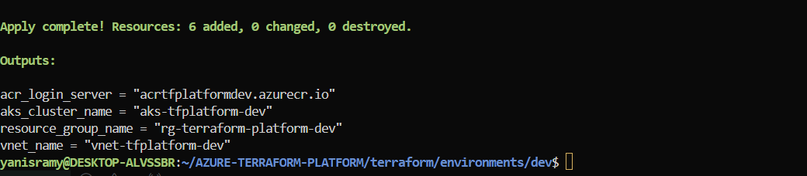
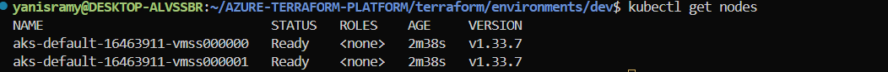
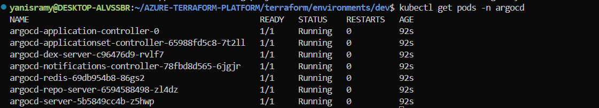
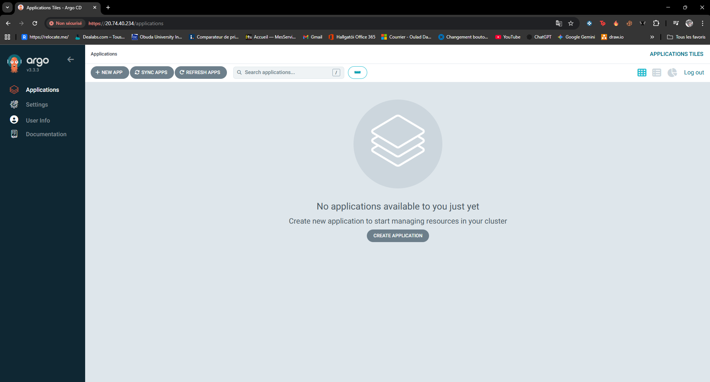
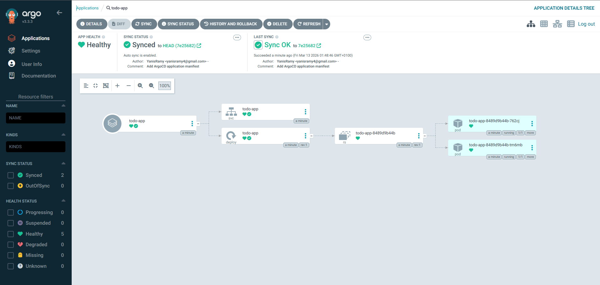
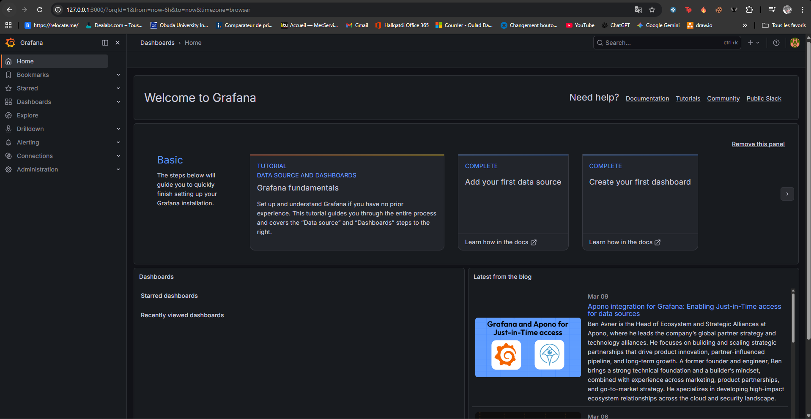
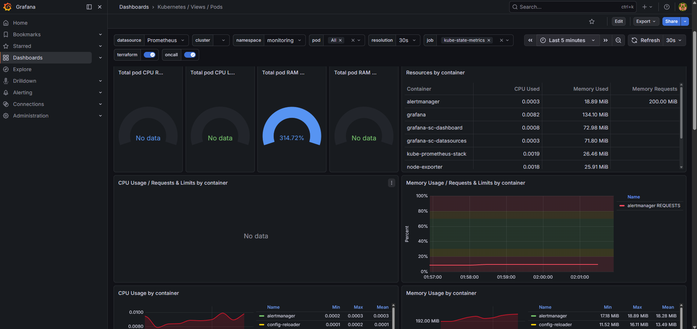

# Azure Terraform Platform - Cloud Infrastructure with ArgoCD & Grafana


## Overview

A complete cloud infrastructure platform deployed on Microsoft Azure using Terraform modules, GitOps with ArgoCD and full observability with Prometheus and Grafana.

This project demonstrates professional-grade Infrastructure as Code practices using HCL, GitOps deployment workflows and real-time Kubernetes monitoring.

---

## Architecture Diagram



---

## Infrastructure

- **Resource Group** : rg-terraform-platform-dev
- **Virtual Network** : vnet-tfplatform-dev (10.0.0.0/8)
- **AKS Subnet** : 10.240.0.0/16
- **AKS Cluster** : aks-tfplatform-dev (2 nodes, Standard_B2s_v2)
- **ACR** : acrtfplatformdev.azurecr.io

---

## Screenshots

### Terraform Plan - 6 resources to create


### Terraform Apply - Infrastructure created successfully


### AKS Nodes - 2 nodes Ready


### ArgoCD Pods - All Running


### ArgoCD - Connected


### ArgoCD - App Healthy and Synced


### Grafana - Home Dashboard


### Grafana - Kubernetes Metrics Dashboard


---

## Tech Stack

| Component | Technology |
|-----------|-----------|
| IaC | Terraform 1.14+ with HCL modules |
| Cloud | Microsoft Azure |
| Container Orchestration | Kubernetes (AKS) |
| Container Registry | Azure Container Registry (ACR) |
| GitOps | ArgoCD v3.3.3 |
| Metrics | Prometheus (kube-prometheus-stack) |
| Dashboards | Grafana |
| Package Manager | Helm v3 |
| Networking | Azure VNet + Subnets |

---

## Project Structure
```
AZURE-TERRAFORM-PLATFORM/
├── terraform/
│   ├── modules/
│   │   ├── network/        # VNet and Subnets
│   │   ├── aks/            # Kubernetes Cluster
│   │   └── acr/            # Container Registry
│   └── environments/
│       └── dev/            # Dev environment config
├── argocd/
│   └── todo-app.yml        # ArgoCD Application manifest
├── apps/
│   └── todo-app/
│       ├── deployment.yml
│       └── service.yml
├── screenshots/
└── README.md
```

---

## Getting Started

### Prerequisites

- Azure CLI + active subscription
- Terraform 1.14+
- kubectl
- Helm v3

### 1. Clone the repo
```bash
git clone https://github.com/YanisRamy/AZURE-TERRAFORM-PLATFORM.git
cd AZURE-TERRAFORM-PLATFORM
```

### 2. Deploy infrastructure with Terraform
```bash
cd terraform/environments/dev
terraform init
terraform plan
terraform apply
```

### 3. Connect kubectl to AKS
```bash
az aks get-credentials --resource-group rg-terraform-platform-dev --name aks-tfplatform-dev
kubectl get nodes
```

### 4. Install ArgoCD
```bash
kubectl create namespace argocd
kubectl apply -n argocd -f https://raw.githubusercontent.com/argoproj/argo-cd/stable/manifests/install.yaml
kubectl patch svc argocd-server -n argocd -p '{"spec": {"type": "LoadBalancer"}}'
```

### 5. Deploy app via GitOps
```bash
kubectl apply -f argocd/todo-app.yml
```

### 6. Install Prometheus + Grafana
```bash
helm repo add prometheus-community https://prometheus-community.github.io/helm-charts
helm install prometheus prometheus-community/kube-prometheus-stack --namespace monitoring
```

---

## Infrastructure Summary

| Resource | Name | Status |
|----------|------|--------|
| Resource Group | rg-terraform-platform-dev | Created |
| Virtual Network | vnet-tfplatform-dev | Created |
| AKS Cluster | aks-tfplatform-dev | Running |
| ACR | acrtfplatformdev.azurecr.io | Created |
| ArgoCD | argocd namespace | Healthy |
| Prometheus | monitoring namespace | Running |
| Grafana | monitoring namespace | Running |
